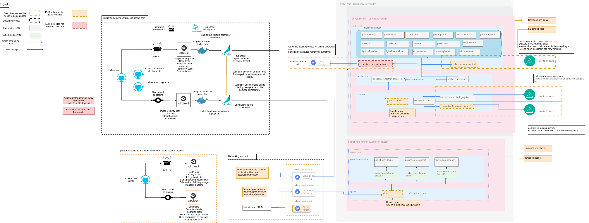

### Infrastructure architecture





### Directory structure
```
mainnet
├── base
├── cert-manager
├── helm
├── monitoring
│   └── helm
└── overlays
    ├── networking
    ├── pocket-core-1
    └── pocket-core-2
```

## Monitoring

### Prometheus operator

Prometheus operator is a helm chart stack that includes grafana/prometheus and other components in order to monitor your entire cluster

To learn more about grafana and prometheus installation visit: https://github.com/helm/charts/tree/master/stable/prometheus-operator 

Here you can find the steps and configuration steps to install prometheus
[Prometheus operator installation instructions](mainnet/monitoring/helm/README.md#prometheus-operator)


### Loki

Loki is a software that alongside with prometheus and grafana show the logs across all the pods running in k8s

Similar to prometheus operator is installed via helm charts 

To learn more about loki please visit: https://grafana.com/docs/loki/latest/installation/helm/

Here you can find the steps and configuration to install loki:

[Loki installation instructions](mainnet/monitoring/helm/README.md#Loki)


## Monitoring

### Gloo 

Gloo is a k8s native ingres controller and api gateway. We use Gloo to expose the validators port to be used to the public 

To learn more about gloo please visit: https://docs.solo.io/gloo-edge/latest/getting_started/

For installing gloo you can see [This readme](mainnet/networking/README#Gloo)

> kubectl create ns gw-mainnet

> helm install gloo-devnet gloo/gloo --namespace gw-mainnet --values mainnet/helm/mainnet.yaml
 

### Cert-manager 

We use cert-manager as certificates manager for installing/maintaining our ssl certs

To learn more about cert-manager please visit: https://cert-manager.io/docs/installation/kubernetes/

For installing cert-manager you can see [This readme](mainnet/networking/README#cert-manager)


## CI/CD and kustomize 


### Flux
Docs: https://docs.fluxcd.io/en/1.21.0/tutorials/get-started/<br>

Flux is a gitops operator. What it does is sync your cluster and your infrastructure repository, so your repository becomes the only source of truth for your kubernetes cluster.

Flux job is to make sure whatever it is in your repository is deployed to your cluste. It applies new changes in the repository to the kubernetes cluster. It checks every 15 mins, this can be configured.  

Make sure to add the right repository and the right path to where your deployment manifest are. <br>


### Kustomize
Docs: https://github.com/kubernetes-sigs/kustomize<br>

Kustomize is a yaml customization tool that allows us to customize manifest while leaving the original intact. The way we set it up is the following:
Our validators within the `overlays` directory use the `mainnet/base` directory as a building block to create all the kubernetes deployments and configurations to make the validator run.

There are a few files inside the `pocket-core-#` directories: 
- config.json
- kustomization.yaml
- node-key-secret.enc.yaml
- priv-val-key-secret.enc.yaml
- patch.yaml

Files ending in .enc.yaml are your encrypted kubernetes secret containing the priv_val_key.json and the node_key.json. Before using SOPS to encrypt the priv_val_key and the node_key, you need to create a kubernetes secret, then encript the kubernetes secret using SOPS. We need to do it this way since Flux will be applying all these manifest to the kubernetes cluster.

patch.yaml contains the customization for the files in the base directory. Here you can add labels, annotations, configMaps, etc. This change will only afect that directory.


## Secret management


### SOPS
Docs: https://github.com/mozilla/sops <br>

Sops is what we use to securely store our private keys in our repository. You can use SOPS with AWS, GCP or Azure KMS. You can also use your own GPG keys.

The file `.sops.yaml` in the root of the repository provides an easy way to especify which key to use on which repository. Using this files helps not having to type the key for each file you need to encrypt/decrypt.

In order to get SOPS to work, you need to either set the `--sops` flag when installing flux or you can edit the flux deployment and add it to the configuration.


### Encrypting your keys

1. Get priv_val_key.json and node_key.json
```
pocket accounts set-validator <address>
```
2. Create a secret from these files
```
kubectl create secret generic pocket-core-node-key1 --from-file ~/.pocket/node_key.json --dry-run -o yaml > node-key-secret.yaml
``` 
```
kubectl create secret generic pocket-core-priv-val-key1 --from-file ~/.pocket/priv_val_key.json --dry-run -o yaml > priv-val-key-secret.yaml
``` 

3. Encrypt kubernetes secrets using sops
```
sops -e node-key-secret.yaml --output node-key-secret.enc.yaml
```
```
sops -e priv-val-key-secret.yaml --output priv-val-key-secret.enc.yaml
```
4. Place the .enc.yaml files in their corresponding directory (`mainnet/overlays/pocket-core-*`) <br><br>
If flux was configured correctly, these changes should be applied automatically to your cluster after they are pushed to the repository.

## NOTE:

Do not upload your plain priv_val_key.json to your repo!
